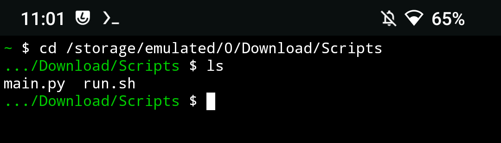
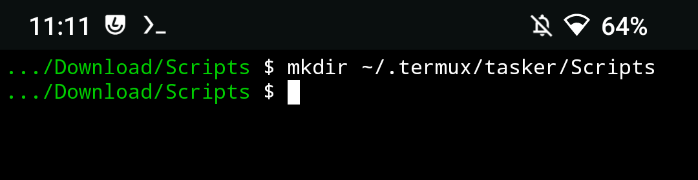
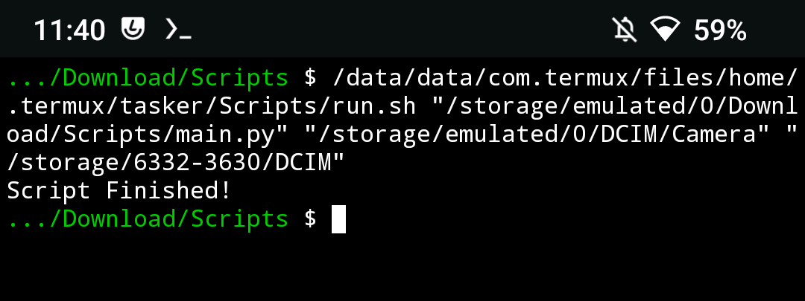
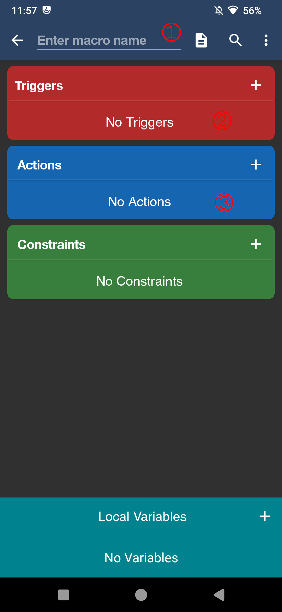
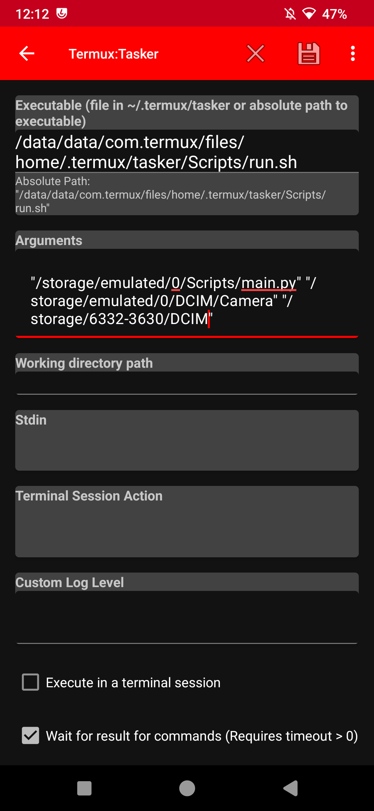
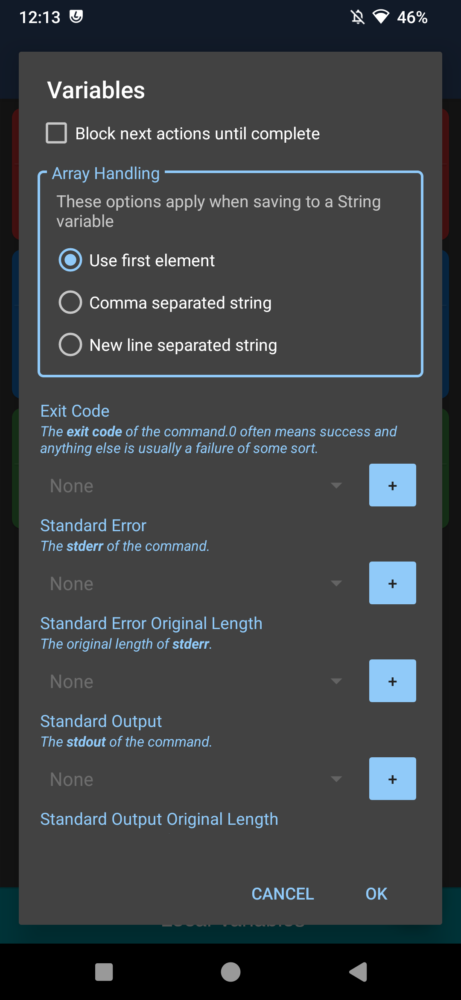

# Copy Files to Directory - Termux + Python + Macrodroid

## Purpose
This file will detail the steps required to move files from one directory in the Android filesystem to the external SD Card using a python script, on macrodroid. I'm doing this because google camera doesn't support saving photos to the external Micro SD card, and I've read you can use macrodroid and a bash script to move files periodically. I'm doing the actual file movement script in python because I know way more python than bash :-)

## Dependecies
This project is targeted for a very specific use case, if you're going to try and replicate this, you will need the following:

- A phone or tablet running Android OS. At the time of writing, Android 13 was used. Device must be rooted.
- [Macrodroid](https://play.google.com/store/apps/details?id=com.arlosoft.macrodroid&hl=en_US)
- [Termux](https://f-droid.org/packages/com.termux/)
- [Termux:Tasker](https://f-droid.org/es/packages/com.termux.tasker/)
- The files from [this repository](https://github.com/Synt4x3rror/Macrodroid_Python_MoveFiles)
- Android: A file manager that will allow you to read/write to the root partition (optional)
- Optional: A Micro SD card, but you could move your files to another directory of your choice.

## Instructions

1. Download Macrodroid from the playstore. Give all the required permissions in order for the app to function properly. You may also need to install helper apps for your device. For more info, visit [This](https://macrodroidforum.com/wiki/index.php/MacroDroid_Wiki) link.
2. Download Termux from F-Droid. Give it the required permissions
3. Download Termux:Tasker plugin from F-Droid. Give it the required permissions
4. Copy the files from [this repository](https://github.com/Synt4x3rror/Macrodroid_Python_MoveFiles) to the android device ([main.py](./main.py), [run.sh](./run.sh)). I used the Downloads directory as example. Make sure to use a directory in the internal storage (not on the SD Card).
5. Open termux and navigate to the directory where you copied the scripts.
   
6. Use the chmod command to assign the execution permission to [run.sh](./run.sh)
    ```
    chmod +x run.sh
    ```
7. Create a /tasker directory on the termux directory. I'm also creating a /Scripts directory but it's optional.
   ```
   mkdir ~/.termux/tasker
   ```
   ```
   mkdir ~/.termux/tasker/Scripts
    ```
   
8. Copy the run.sh file to that directory. If using a file manager, the full path to the directory will be:
    ```
   /data/data/com.termux/files/home/.termux/tasker/Scripts
   ```
   **Remember that path, we will be using it shortly!**
9. (Optional but **highly** recommended) Test that the shell script is working properly. The shell script takes three parameters:
   - Path to python file [main.py](./main.py)
   - Source directory from where to move photos from
   - Target Directory

   Example:
   ```
   /data/data/com.termux/files/home/.termux/tasker/Scripts/run.sh "/storage/emulated/0/Download/Scripts/main.py" "/storage/emulated/0/DCIM/Camera" "/storage/6332-3630/DCIM"
   ```
   If you get "Script Finished" as output, congrats! Script ran successfully!
   
10. On Macrodroid choose the "Add Macro" button. On the next screen assign the macro a name.
11. Choose a trigger that works for you. The most basic example I could think of is the widget button, so I'll be using that one in this example.\
   </img>

12. On the actions block add a new action. Choose Applications > Tasker/Locale Plugin > Termux:Tasker > Termux
13. On the executable path copy the path to the .sh file. See step 9
14. On the arguments box, copy IN ORDER the path to the python file, path to source directory, and path to target directory. Leave the rest of the parameters as default. Press the save button on the top left.\
   </img>

15. Leave parameters as default and press OK\
   </img>

16. Press on the bottom right icon to save your macro
17. Test your macro. Any issues should be catched by the macrodroid log. Best of luck!